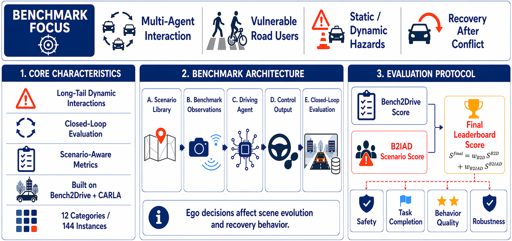

# CVCI_BenchMark

<p align="center">
  <a href="./assets/CVCI_2026_Benchmark_Poster_1.pdf">
    
  </a>
</p>

<p align="center">
  <strong>Bench2InterActDrive: A Closed-Loop Benchmark for End-to-End Autonomous Driving at CVCI 2026</strong>
</p>

<p align="center">
  Built upon <a href="https://github.com/Thinklab-SJTU/Bench2Drive">Bench2Drive</a> and CARLA for safety-critical, long-tail, and highly interactive driving evaluation.
</p>

---

## Overview

**CVCI_BenchMark (Bench2InterActDrive)** is a closed-loop benchmark for evaluating end-to-end autonomous driving systems under safety-critical, long-tail, and highly interactive traffic scenarios.

Built upon [Bench2Drive](https://github.com/Thinklab-SJTU/Bench2Drive) and CARLA, this benchmark extends standard route-level evaluation with a scenario-aware behavioral assessment protocol to better measure robustness, safety, and interaction quality in challenging driving situations.

This repository provides the benchmark routes, scenario implementations, and evaluation pipeline used in **CVCI 2026**.

For more details, please refer to:

- [introduction.pdf](./assets/introduction.pdf): benchmark motivation, design, and protocol
- [web_description.docx](./assets/web_description.docx): challenge description referenced on the poster
- [CVCI_2026_Benchmark_Poster_1.pdf](./assets/CVCI_2026_Benchmark_Poster_1.pdf): benchmark poster

---

## Key Features

- **Closed-loop online evaluation** in CARLA
- **12 scenario categories** with **144 scenario instances**
- **Three progressive difficulty levels** defined by scenario-specific parameters
- **Four weather and lighting variants**:
  - `night&rain`
  - `night&sunny`
  - `day&rain`
  - `day&sunny`
- **Dual-score evaluation protocol**:
  - Bench2Drive route-level score
  - CVCI scenario-aware interaction score

---

## Benchmark Foundation

This benchmark is developed on top of the official **Bench2Drive** framework:

- **Bench2Drive repository:** [https://github.com/Thinklab-SJTU/Bench2Drive](https://github.com/Thinklab-SJTU/Bench2Drive)

The standard route-level evaluation in this benchmark follows the official Bench2Drive implementation and scoring logic.  
The CVCI extension further introduces scenario-aware behavioral scoring for interactive risk scenarios.

---

## Environment Setup

### 1. Create Python Environment

```bash
conda create -n CVCI_Benchmark python=3.7 -y
conda activate CVCI_Benchmark
```

### 2. Install CARLA 0.9.15

```bash
mkdir -p ~/carla && cd ~/carla
wget https://carla-releases.s3.us-east-005.backblazeb2.com/Linux/CARLA_0.9.15.tar.gz
tar -xvf CARLA_0.9.15.tar.gz
cd Import
wget https://carla-releases.s3.us-east-005.backblazeb2.com/Linux/AdditionalMaps_0.9.15.tar.gz
cd ..
bash ImportAssets.sh
```

### 3. Install Dependencies

```bash
cd /path/to/CVCI_BenchMark
pip install -r scenario_runner/requirements.txt
pip install -r leaderboard/requirements.txt
```

### 4. Export Environment Variables

```bash
export CARLA_ROOT=/path/to/CARLA_0.9.15
export SCENARIO_RUNNER_ROOT=scenario_runner
export LEADERBOARD_ROOT=leaderboard
export PYTHONPATH=$PYTHONPATH:${CARLA_ROOT}/PythonAPI
export PYTHONPATH=$PYTHONPATH:${CARLA_ROOT}/PythonAPI/carla
export PYTHONPATH=$PYTHONPATH:${CARLA_ROOT}/PythonAPI/carla/dist/carla-0.9.15-py3.7-linux-x86_64.egg
export PYTHONPATH=$PYTHONPATH:leaderboard
export PYTHONPATH=$PYTHONPATH:scenario_runner
```

---

## Running Evaluation

```bash
python leaderboard/leaderboard/leaderboard_evaluator.py \
  --routes scenario_runner/srunner/data/CVCI_BenchMark.xml \
  --routes-subset 0-143 \
  --agent leaderboard/leaderboard/autoagents/human_agent.py \
  --checkpoint ./evaluation_results/cvci_benchmark.json
```

---

## Metrics and Result Processing

```bash
python tools/merge_route_json.py -f /path/to/json_folder/
python tools/ability_benchmark.py -r merge.json
python tools/efficiency_smoothness_benchmark.py -f merge.json -m /path/to/metric_folder/
```

---

## Evaluation Protocol

The final benchmark result is obtained by combining two complementary evaluation components:

1. **Bench2Drive route-level score**
2. **CVCI scenario-aware interaction score**

### Bench2Drive Route-Level Score

The route-level driving score follows the official evaluation protocol of Bench2Drive.  
It is used to measure general driving performance over benchmark routes, including route completion and penalty-aware driving quality.

Please refer to the official repository for the original implementation and scoring details:

- [Bench2Drive Official Repository](https://github.com/Thinklab-SJTU/Bench2Drive)

In this benchmark, the **Bench2Drive score is computed according to the official Bench2Drive evaluation pipeline**.

### CVCI Scenario-Aware Interaction Score

To better evaluate performance in highly interactive and safety-critical scenarios, CVCI_BenchMark introduces an additional scenario-aware behavioral assessment.

This component is designed to measure whether the agent performs the intended key behaviors required by each scenario, instead of receiving excessive credit from overly conservative or stop-only strategies.

The scenario-aware score is based on three aspects:

- **Scenario-aligned behavioral criteria**  
  Each scenario is equipped with behavior-oriented criteria tailored to its interaction intent, such as hazard response, deceleration timing, conflict resolution, avoidance quality, and safe recovery.

- **Safety-sensitive failure handling**  
  Severe failures, including collisions and other critical violations, are incorporated through strict safety constraints and penalty mechanisms.

- **Behavior quality under interaction**  
  The final scenario score reflects not only whether the agent remains safe, but also whether it completes the interactive task in a reasonable, stable, and behaviorally appropriate manner.

This design makes the benchmark more interpretable and more faithful to the intended evaluation targets of challenging autonomous driving scenarios.

### Final Benchmark Score

The final benchmark result is computed through a **weighted fusion** of:

- the **standard Bench2Drive route-level score**, and
- the **CVCI scenario-aware interaction score**

This dual-score design allows the benchmark to jointly evaluate:

- overall route-following and general driving competence
- fine-grained behavioral quality in interactive risk scenarios

As a result, the benchmark can better distinguish robust and capable autonomous driving systems from policies that appear safe only because they are excessively conservative.

---

## Data Download

Bench2InterActDrive data is available at:

- [Hugging Face Dataset](https://huggingface.co/datasets/55sleeper/CVCI_BENCHmark/tree/main)

---

## CVCI 2026 Timeline

- **Benchmark and data release:** April 25, 2026
- **Paper + challenge result submission:** July 1, 2026
- **Final result submission:** September 1, 2026

---

## Citation

If you use this benchmark in your research, please cite the corresponding benchmark paper or challenge description when available.

---

## License

All assets and code in this repository are released under the repository license unless otherwise specified.
